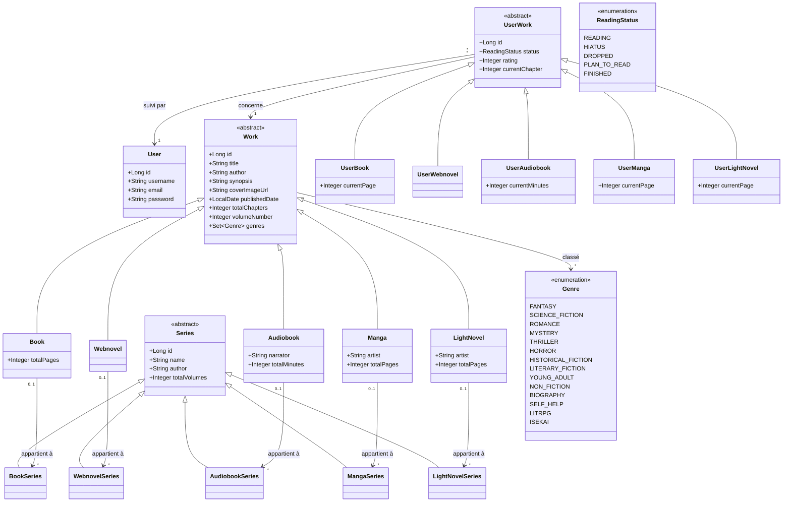
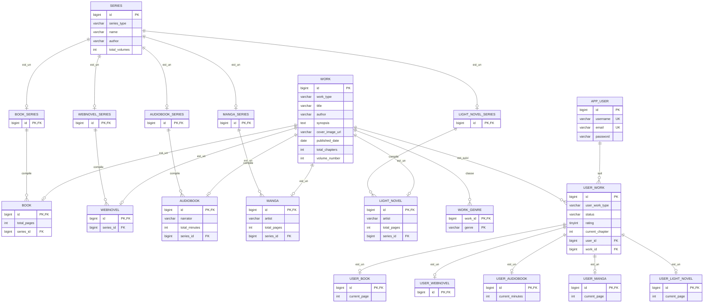

# Document de conception - BookShelf

Le modèle part du besoin métier (tracker de lecture façon Goodreads, cf. `PROJECT_CONTEXT.md`) et de l'entité `Book` déjà existante en code.

## 1. Décisions de modélisation

- **Statut de lecture / note / progression ne sont pas des propriétés du livre** : `status`, `rating` et `currentChapter` vivaient sur `Book`, mais un même livre peut être "FINISHED" pour un utilisateur et "PLAN_TO_READ" pour un autre — ce sont des propriétés de la relation *utilisateur-œuvre*, pas de l'œuvre elle-même. Extraits dans une classe association `UserWork`.
- **`User` modélisé dès maintenant**, bien qu'aucune authentification ne soit encore implémentée (Spring Security = jalon futur non urgent) : anticipe la forme cible réelle (multi-utilisateur) plutôt que de figer une conception mono-utilisateur qu'il faudrait défaire plus tard.
- **Connexion par username/password, email optionnel** : `username` est le moyen de connexion principal et reste obligatoire/unique ; `email` est nullable (pas indispensable pour utiliser l'appli) mais reste unique **si renseigné** — une contrainte `UNIQUE` standard l'autorise nativement, une colonne nullable peut contenir plusieurs `NULL` sans violer l'unicité, seules les valeurs non-`NULL` doivent être distinctes.
- **Distinction livre / webnovel / audiobook / manga / light novel via héritage, pas un simple champ `format`** : `Audiobook` a besoin d'un `narrator`, `Manga`/`LightNovel` d'un `artist` — des attributs qui n'ont pas de sens pour un `Book` ou un `Webnovel`. Un enum `format` sur une seule classe `Book` aurait forcé ces colonnes à exister (nullables) même quand elles ne s'appliquent pas. Modélisé comme une hiérarchie : `Work` (classe abstraite, attributs communs) avec `Book`, `Webnovel`, `Audiobook`, `Manga`, `LightNovel` en sous-classes portant chacune ses attributs propres. `Genre` a été nettoyé en conséquence : `MANGA`/`LIGHT_NOVEL`/`WEB_NOVEL` en sortent (ce sont des formats, pas des genres) — un genre (fantasy, romance...) reste orthogonal au format (webnovel, manga...) : un `Manga` peut très bien être `FANTASY`.
- **Stratégie d'héritage JPA de `Work` : `JOINED`** — une table `work` pour les attributs communs, plus une table par sous-classe (`book`, `webnovel`, `audiobook`, `manga`, `light_novel`) qui ne porte que ses colonnes propres, liée à `work` par PK/FK partagée. Choisi plutôt que `SINGLE_TABLE` (aurait remis des colonnes `narrator`/`artist` nullables sur une table unique — exactement le problème que la hiérarchie cherchait à éviter) ou `TABLE_PER_CLASS` (duplique les colonnes de `Work` dans chaque sous-classe, complique les requêtes polymorphiques). Coût accepté : lire une `Audiobook` complète nécessite un `JOIN work + audiobook`.
- **`volumeNumber` reste sur `Work`, partagé par toutes les sous-classes** : une même histoire peut exister en plusieurs tomes et/ou en une séquence continue, tous rattachés à une série — mais l'`id` technique d'un `Work` n'a aucune signification d'ordre. `volumeNumber` (`Integer`, nullable) sert à ordonner les entrées d'une série ; nullable, une œuvre standalone (pas de série) ou une entrée non numérotée n'en a pas. Une version antérieure de ce document l'avait fait migrer vers chaque sous-classe en même temps que `series_id`, par cohérence avec ce dernier — mais contrairement à `series_id` (qui doit être typé par sous-classe pour la raison ci-dessous), `volumeNumber` est rigoureusement identique dans chaque sous-classe (même type, même sens) : le dupliquer cinq fois n'apportait aucune garantie supplémentaire, seulement de la répétition. Remonté sur `Work` une fois ce constat fait.
- **Une `Series` est contenue à un seul format** : la saga *Lord of the Mysteries* illustre le besoin — sa "série webnovel" (`Lord of the Mysteries` tome 1, `Circle of Inevitability` tome 2) est une séquence distincte d'une éventuelle future "série de tomes imprimés" du même univers, si un éditeur découpe un jour le webnovel en volumes papier. Ce sont deux séquences d'ordre indépendantes, pas une seule série mélangeant les formats. Un `series_id` générique porté par `Work` ne pourrait pas empêcher structurellement un `Book` de pointer vers ce qui devait être une série réservée aux `Webnovel` — seule une convention de code le garantirait. Modélisé en miroir de la hiérarchie `Work` : `Series` devient abstraite (`id`, `name`, `author`), avec des sous-classes `BookSeries`/`WebnovelSeries`/`AudiobookSeries`/`MangaSeries`/`LightNovelSeries` qui n'ajoutent aucun attribut propre — elles existent uniquement pour que chaque sous-classe de `Work` puisse référencer *sa* table de série spécifiquement (`book.series_id → book_series.id`, `webnovel.series_id → webnovel_series.id`, etc.), rendant le mélange de formats structurellement impossible plutôt que simplement déconseillé. `series_id` quitte donc `Work` pour vivre sur chaque sous-classe ; `volumeNumber`, lui, reste sur `Work` (voir point précédent).
- **`Series.name` toujours pas unique, `Series.author` toujours obligatoire** : deux séries différentes (même dans un même format) peuvent légitimement partager un titre (deux auteurs différents publiant chacun une série "Welcome to Hell", par exemple) — une contrainte UNIQUE(name) romprait ce cas réel. `author` reste `NOT NULL` pour permettre de désambiguïser systématiquement à l'affichage/recherche.
- **`totalVolumes` ajouté sur `Series`, à côté de `volumeNumber` sur `Work`** : `volumeNumber` (sur `Work`) numérote un tome individuel au sein de sa série ; `totalVolumes` (sur `Series`) donne le nombre total de tomes prévus/publiés pour la série entière. C'est une propriété de la série elle-même, pas de chaque tome — la porter sur `Work` aurait dupliqué la même valeur sur chaque œuvre rattachée à la série, exactement le problème déjà évité en remontant `volumeNumber` (voir point précédent, cas inverse). `Integer`, nullable : une série en cours (ex. webnovel toujours en publication) ne connaît pas encore son total final.
- **Faire évoluer l'enum `Genre` a un coût caché** : ajouter une constante est sans risque (aucune ligne existante n'est affectée). **Renommer** ou **supprimer** une constante déjà utilisée dans `work_genre` casse silencieusement la lecture de ces lignes : `EnumType.STRING` protège contre la réorganisation de l'ordre des constantes (contrairement à `ORDINAL`), mais pas contre un renommage — Hibernate lève une `IllegalArgumentException` au premier chargement d'une ligne portant l'ancien nom, à l'exécution, pas à la compilation. Un renommage/suppression nécessite donc une vraie migration de données (`UPDATE work_genre SET genre = ... WHERE genre = ...` avant de retirer la constante côté code) — rejoint la remarque déjà faite dans `PROJECT_CONTEXT.md` sur Flyway/Liquibase comme future gestion propre des migrations de schéma et de données.
- **`totalChapters`/`currentChapter` restent communs à tous les formats, mais `totalPages`/`currentPage` et `totalMinutes`/`currentMinutes` s'ajoutent là où c'est pertinent** : chapitre reste l'unité de progression universelle (webnovel, book, light novel, manga, audiobook ont tous un découpage en chapitres) ; `Book`/`LightNovel`/`Manga` ont en plus un total de pages ; `Audiobook` a en plus une durée. Ajoutés en sous-classe (`Book.totalPages`, `Audiobook.totalMinutes`, etc.) plutôt que sur `Work`, pour la même raison que `narrator`/`artist` : ces colonnes n'ont pas de sens pour un `Webnovel`. Nommés `totalMinutes`/`currentMinutes` (pas `totalTime`/`currentTime`) dès le côté Java, pas seulement en base : `CURRENT_TIME` est un mot réservé MariaDB/MySQL (fonction équivalente à `CURTIME()`), même catégorie de problème que `user` → `app_user` — nommer directement le champ `totalMinutes` fait correspondre automatiquement la stratégie de nommage d'Hibernate (camelCase → snake_case) à la colonne voulue (`total_minutes`), sans nécessiter un `@Column(name = ...)` explicite pour contourner le mot réservé.
- **`Integer` plutôt que `Duration`/`LocalTime` pour `totalMinutes`/`currentMinutes`** : `LocalTime` modélise un point dans la journée (une heure d'horloge), pas une durée — inadapté ici, et plafonné à un peu moins de 24h, alors qu'un audiobook (surtout un recueil/omnibus) peut dépasser cette limite. `Duration` serait le type sémantiquement correct pour une durée, mais apporte une précision (secondes, voire nanosecondes) dont le suivi de progression n'a pas besoin en v1 — cohérent avec le choix déjà fait de rester sur des entiers simples pour `totalChapters`/`currentChapter`. Un passage à `Duration` reste possible plus tard si un besoin réel de précision plus fine émerge ; pas nécessaire pour une v1.
- **`UserWork` devient elle aussi une hiérarchie (`UserBook`/`UserWebnovel`/`UserLightNovel`/`UserManga`/`UserAudiobook`)** : suivre la progression d'un utilisateur en pages (`currentPage`) ou en temps (`currentTime`) est spécifique au format suivi, exactement comme `totalPages`/`totalTime` côté `Work` — les mêmes colonnes nullables éparses réapparaîtraient sur une `UserWork` non subdivisée. `status`/`rating`/`currentChapter` restent sur `UserWork` (communs à tous les formats) ; `currentPage` est ajouté sur `UserBook`/`UserLightNovel`/`UserManga`, `currentTime` sur `UserAudiobook`. Stratégie `JOINED`, même raisonnement que pour `Work` (colonnes réellement différentes selon la sous-classe → `SINGLE_TABLE` recréerait le problème).
- **`user_id`/`work_id` restent sur `UserWork` (le parent), pas poussés vers les sous-classes** : contrairement à `Series`, où pousser `series_id` vers chaque sous-classe de `Work` apportait une vraie garantie de typage, faire pareil ici casserait la contrainte `UNIQUE(user_id, work_id)` — elle a besoin des deux colonnes dans la même table pour s'exprimer comme une contrainte SQL simple, alors qu'elles vivraient sur deux tables différentes (`user_work` et `user_book`, par exemple) si `work_id` migrait vers la sous-classe. Le gain de typage (empêcher une `UserBook` de référencer un `Webnovel`) ne justifie pas de perdre cette contrainte d'unicité — laissé en garde applicative plutôt que structurelle, contrairement au choix fait pour `Series`.
- **Bornes numériques ajoutées sur les colonnes `total_*`/`current_*`/`volume_number`** : seul `rating` avait une contrainte `CHECK` jusqu'ici. Un `total_chapters`/`current_page`/`volume_number` négatif ou nul n'a pas de sens métier — `CHECK (... IS NULL OR ... > 0)` ajouté sur chacune, par cohérence. La cohérence `current ≤ total` (ex. `current_page` ne devrait jamais dépasser `total_pages`) n'est en revanche pas vérifiable par un simple `CHECK` mono-table : les deux colonnes vivent volontairement dans des tables différentes (`user_book`/`book`), conséquence directe de la séparation `UserWork`/`Work` — laissé en garde applicative, comme le typage `UserBook` ↔ `Book` (voir plus haut).
- **Index ajouté sur `work_genre.genre`** : la clé primaire composite `(work_id, genre)` ne sert que les requêtes partant de `work_id` ; parcourir "toutes les œuvres du genre FANTASY" nécessiterait un scan complet sans index dédié sur `genre` seul. Ajouté par anticipation d'un futur filtrage par genre, même si le mockup UI actuel filtre uniquement par statut de lecture (cf. `PROJECT_CONTEXT.md`).
- **Rien n'empêche la création accidentelle d'une même série en double** : `(name, author)` n'est volontairement pas unique (voir ci-dessus), donc une faute de frappe ou un oubli de rechercher l'existant peut créer deux `Series` distinctes pour la même vraie saga. Pas un problème de schéma à corriger (une contrainte d'unicité romprait le cas des homonymes légitimes) — plutôt une préoccupation d'UI/UX à traiter plus tard (ex. recherche/autocomplete des séries existantes avant d'en proposer la création).
- **`language` (présent sur l'entité `Book` d'origine) volontairement abandonné** : jugé non pertinent dans le contexte de l'appli — contrairement à `publisher` (repoussé mais toujours envisagé plus tard), `language` n'est pas prévu d'être réintroduit.
- **`publisher` non modélisé pour l'instant** : une œuvre peut avoir plusieurs éditeurs (régions différentes, ou changement de droits sur un même marché), ce qui en ferait une vraie relation many-to-many avec ses propres attributs (région, date) — complexité repoussée à une fois l'application de base fonctionnelle (cf. `PROJECT_CONTEXT.md`).
- **Champs de créateur (`Work.author`, `Series.author`, `Manga`/`LightNovel.artist`, `Audiobook.narrator`) : valeur simple, sans historique — repoussé, pas non plus modélisé pour l'instant** : chacun est un `String` unique, écrasé à chaque mise à jour, alors que dans la réalité ces crédits peuvent changer au fil d'une série (ex. un mangaka qui décède en cours de publication et se fait remplacer par un autre artiste, un titre audiobook réenregistré avec un nouveau narrateur). Le modèle actuel ne peut représenter que "qui est le créateur actuel", pas "qui a fait quoi pour quels tomes/chapitres". Même famille de problème que `publisher` ci-dessus (une vraie relation many-to-many avec ses propres attributs — ici un `role` et une plage de tomes/dates — plutôt qu'un champ scalaire), et repoussé pour la même raison : complexité non justifiée avant que l'application de base soit fonctionnelle. Modéliserait ce jour-là une entité de jonction `Contribution`/`Credit` (`Work`/`Series` ↔ personne), la première relation many-to-many *avec attributs* du projet — `Genre` n'en est pas une, juste une `@ElementCollection` sans attribut propre. Repéré une première fois le 2026-08-06 sur `Work.author`/`Manga`/`LightNovel.artist`, élargi le même jour à `Series.author` et `Audiobook.narrator` en repassant sur la conception.
- **`UserWork` : une seule ligne de suivi par `(user, work)`, pas d'historique de relecture — même famille de problème, côté suivi plutôt que côté œuvre** : `UNIQUE(user_id, work_id)` (voir section 4) garantit qu'un utilisateur n'a jamais qu'une seule ligne `status`/`rating`/`currentChapter` par œuvre — une relecture (ex. lu une première fois en 2020, noté 7/10, relu en 2024, noté 9/10) n'a nulle part où exister sans écraser la lecture précédente. Repéré le 2026-08-06 en cherchant d'autres cas du même problème que les champs de créateur ci-dessus : un champ/une ligne mutable unique qui tient lieu d'un historique réel. Pas urgent — le mockup UI actuel (onglets par statut unique) n'en a pas besoin — mais à garder en tête si un suivi "date de lecture" ou les relectures deviennent un besoin réel : `UserWork` devrait alors devenir une relation one-to-many ("entrées de lecture", chacune avec ses propres dates/note/statut) plutôt que la ligne unique actuelle, un vrai changement de schéma, pas un ajustement.

## 2. Diagramme de classes



### Justifications

- **`UserWork` en classe association abstraite** (renommée depuis `UserBook`, puis subdivisée) : porte `status`/`rating`/`currentChapter`, des attributs propres à la relation `User`-`Work` communs à tous les formats. `UserBook`/`UserWebnovel`/`UserAudiobook`/`UserManga`/`UserLightNovel` en héritent et ajoutent `currentPage`/`currentTime` là où c'est pertinent — même logique que `Work`/`Book`/`Audiobook`, appliquée au suivi de progression plutôt qu'à l'œuvre elle-même.
- **`Work` abstraite, `Book`/`Webnovel`/`Audiobook`/`Manga`/`LightNovel` concrètes** : chaque sous-classe n'ajoute que ce qui lui est propre (`narrator`, `artist`, `totalPages`/`totalTime`) ; `volumeNumber` reste sur `Work` puisqu'il est identique pour toutes (voir section 1). `Webnovel` reste la plus dépouillée : aucun attribut de contenu propre.
- **`Series` abstraite, `BookSeries`/`WebnovelSeries`/`AudiobookSeries`/`MangaSeries`/`LightNovelSeries` concrètes, mais sans aucun attribut propre** : contrairement à `Work`, où `JOINED` se justifiait par des colonnes réellement différentes entre sous-classes (`narrator` vs `artist`), ici toutes les sous-classes de `Series` ont exactement les mêmes attributs. `JOINED` est choisi pour une raison différente : obtenir une vraie table par format, afin que chaque sous-classe de `Work` puisse porter une FK *typée* vers sa propre table de série (`book.series_id → book_series.id`) — une garantie structurelle qu'un `Book` ne peut jamais référencer une `WebnovelSeries`, chose qu'un simple `series.format` (colonne discriminante sur une table unique, sans FK typée) ne pourrait offrir qu'au niveau applicatif.
- **`user_id`/`work_id` ne suivent pas `Series` dans cette logique de FK typée** : contrairement à `series_id` (poussé vers chaque sous-classe de `Work`), `work_id` reste sur `UserWork` (le parent) — pousser `work_id` vers `UserBook`/`UserWebnovel`/etc. casserait la contrainte `UNIQUE(user_id, work_id)`, qui a besoin des deux colonnes dans une seule table pour s'exprimer simplement en SQL. Compromis assumé : `UserBook` pourrait en théorie référencer un `Webnovel` sans que le schéma l'empêche — risque jugé moins grave que celui résolu pour `Series`, et la contrainte d'unicité vaut la peine d'être gardée intacte.
- **`Genre` en `<<enumeration>>`, pas en classe persistée à part** : pas de table de référence dédiée ; côté JPA, `Work.genres` est une `@ElementCollection @Enumerated(EnumType.STRING)`, qui génère une simple table de jonction (`work_genre`) sans entité `Genre` propre. Une table de jonction stocke une ligne par (œuvre, genre) — une œuvre à plusieurs genres n'a donc jamais besoin de concaténer une liste dans une seule colonne.
- **Cardinalité `Book "0..1" --> "*" BookSeries`** (et équivalent pour les autres formats) : une œuvre est soit standalone (`0` série), soit rattachée à exactement une série de son propre format (`1`) ; une série regroupe potentiellement plusieurs œuvres/tomes de ce même format (`*`).
- **`ReadingStatus` inchangé** : toujours le même enum (`READING`/`HIATUS`/`DROPPED`/`PLAN_TO_READ`/`FINISHED`, cf. `PROJECT_CONTEXT.md`), seul son propriétaire change (`UserWork` au lieu de `Book`).

## 3. Modèle entité-association



## 4. Choix de conception

### Clés primaires

Toutes les entités utilisent des clés techniques `BIGINT AUTO_INCREMENT` (`Long id` côté JPA, `GenerationType.IDENTITY`). Les tables de sous-classes — celles de `Work` (`book`, `webnovel`, `audiobook`, `manga`, `light_novel`), celles de `Series` (`book_series`, `webnovel_series`, `audiobook_series`, `manga_series`, `light_novel_series`) et celles de `UserWork` (`user_book`, `user_webnovel`, `user_audiobook`, `user_manga`, `user_light_novel`) — réutilisent toutes le même `id` que leur ligne parente (PK = FK, pas de génération propre).

### Contraintes d'unicité (UK)

- `APP_USER.username` : unique, `NOT NULL` — moyen de connexion principal.
- `APP_USER.email` : unique, mais **nullable** — un `UNIQUE` sur colonne nullable autorise plusieurs `NULL` (seules les valeurs renseignées doivent être distinctes), ce qui correspond exactement au besoin ("pas obligatoire, mais pas de doublon si utilisé").
- `USER_WORK(user_id, work_id)` : unique — un utilisateur ne peut suivre une même œuvre qu'une seule fois (une seule ligne de statut/note/progression par paire utilisateur-œuvre). Reste sur `USER_WORK` (le parent) précisément parce que `user_id` et `work_id` doivent cohabiter dans une seule table pour que cette contrainte s'exprime en SQL simple (voir section 1).
- `SERIES.name` : **volontairement pas unique** (voir section 1) ; `SERIES.author` est en revanche obligatoire (`NOT NULL`), pour permettre de distinguer deux séries homonymes. Contrepartie assumée : rien n'empêche une vraie duplication accidentelle de la même série (voir section 1) — traité comme un problème d'UI/UX, pas de schéma.

### Stratégie d'héritage de Work (Book / Webnovel / Audiobook / Manga / LightNovel)

`JOINED` retenu : `work` porte les colonnes communes — dont `volume_number`, identique pour tous les formats — plus une colonne discriminante `work_type` (utilisée par Hibernate pour savoir quelle table fille rejoindre) ; chaque sous-classe a sa propre table ne portant que ses colonnes réellement spécifiques (`total_pages`/`total_minutes`, `narrator`/`artist`), sans aucune colonne nullable inutile ni répétition d'une colonne identique d'une sous-classe à l'autre. Alternatives écartées :

- `SINGLE_TABLE` aurait mis `narrator`/`artist`/`total_pages`/`total_minutes` en colonnes nullables directement sur `work` — recrée le problème que la hiérarchie visait à éviter.
- `TABLE_PER_CLASS` aurait dupliqué toutes les colonnes de `Work` dans `book`, `webnovel`, etc., et complique les requêtes du type "toutes les œuvres suivies par un utilisateur, tous formats confondus" (nécessite un `UNION`).

### Stratégie d'héritage de Series (BookSeries / WebnovelSeries / AudiobookSeries / MangaSeries / LightNovelSeries)

`JOINED` retenu ici aussi, mais pour une raison différente de celle de `Work` : aucune sous-classe de `Series` n'ajoute de colonne propre (toutes ont exactement `id`/`name`/`author`/`total_volumes`), donc l'argument "éviter des colonnes nullables éparses" ne s'applique pas. La raison est plutôt de donner à chaque sous-classe de `Work` une **FK typée** vers sa propre table de série (`book.series_id → book_series.id`, `webnovel.series_id → webnovel_series.id`, etc.) : la base garantit ainsi structurellement qu'un `Book` ne peut jamais référencer une `WebnovelSeries`. Alternative écartée : une seule table `series` avec une colonne `format`, et la règle "un `Book` ne référence qu'une série `format = BOOK`" vérifiée uniquement côté service/validation — plus simple (une seule table), mais la contrainte ne serait garantie que par la discipline du code, pas par le schéma.

### Stratégie d'héritage de UserWork (UserBook / UserWebnovel / UserAudiobook / UserManga / UserLightNovel)

`JOINED` retenu pour la même raison que `Work` (pas celle de `Series`) : `currentPage`/`currentTime` sont des colonnes réellement différentes selon la sous-classe suivie, et `SINGLE_TABLE` les aurait remises nullables sur une `user_work` unique. `status`/`rating`/`currentChapter` restent sur `user_work` (le parent), communs à tous les formats.

Différence assumée avec `Series` : `user_id`/`work_id` **ne migrent pas** vers les sous-classes. Le suivre aurait offert la même garantie de typage qu'entre `book`/`book_series` (empêcher une `UserBook` de référencer un `Webnovel`), mais aurait aussi cassé `UNIQUE(user_id, work_id)`, qui a besoin des deux colonnes dans la même table. Le compromis retenu : garder la contrainte d'unicité intacte, accepter que le bon typage `UserBook` ↔ `Book` reste une garantie applicative plutôt que structurelle.

### Normalisation du genre

`Genre` reste un enum Java, pas une table — vocabulaire fermé contrôlé par le code, pas par la saisie utilisateur, donc pas de risque de variante orthographique. La table `work_genre` générée par Hibernate n'a pas de clé technique propre : clé primaire composite `(work_id, genre)`, cohérente avec le fait qu'une œuvre n'a pas besoin d'avoir deux fois le même genre. `MANGA`/`LIGHT_NOVEL`/`WEB_NOVEL` ont été retirés de cet enum : ce sont des formats (désormais portés par la hiérarchie `Work`), pas des genres — un `Manga` peut être `FANTASY`, un `Webnovel` peut être `ISEKAI`, etc.

Le vocabulaire actuel (`FANTASY`, `SCIENCE_FICTION`, `ROMANCE`, ...) est un premier jet, pas figé — l'enum grandira avec l'usage réel de l'appli. Ajouter une constante est sans risque. Renommer ou supprimer une constante déjà utilisée dans des lignes `work_genre` existantes ne l'est pas : `EnumType.STRING` stocke le nom littéral de la constante, donc toute ligne portant l'ancien nom devient illisible pour Hibernate (`IllegalArgumentException` à l'exécution, pas d'erreur de compilation). Un tel changement nécessite une migration de données explicite (`UPDATE work_genre SET genre = '<nouveau>' WHERE genre = '<ancien>'`) avant de retirer l'ancienne constante côté code — un cas d'usage concret pour Flyway/Liquibase une fois ce jalon atteint (cf. `PROJECT_CONTEXT.md`).

### Nullabilité (FK et colonnes optionnelles)

- `BOOK.series_id` / `WEBNOVEL.series_id` / `AUDIOBOOK.series_id` / `MANGA.series_id` / `LIGHT_NOVEL.series_id` : nullable (`0..1`) — toutes les œuvres ne font pas partie d'une série.
- `WORK.volume_number` : nullable — n'a de sens que pour une œuvre rattachée à une série et numérotée dans celle-ci ; une œuvre standalone n'en a pas. Reste sur `WORK` (pas sur les sous-classes) car identique pour tous les formats, contrairement à `series_id` (voir section 1 et "Stratégie d'héritage de Work").
- `SERIES.total_volumes` : nullable — le nombre total de tomes n'est pas toujours connu, notamment pour une série encore en cours de publication (voir section 1).
- `WORK.total_chapters` : nullable — inconnu pour un webnovel en cours de publication.
- `BOOK.total_pages` / `MANGA.total_pages` / `LIGHT_NOVEL.total_pages` : nullable — peut rester inconnu (édition non encore cataloguée en détail).
- `AUDIOBOOK.total_minutes` : nullable — même raison ; exprimé en minutes (`INT`), pas de type `TIME`/`DURATION` dédié, cohérent avec la simplicité des autres colonnes numériques du schéma. Nommé `total_minutes` (pas `total_time`) : `CURRENT_TIME` est un mot réservé MariaDB/MySQL, mieux vaut éviter `time` dans un nom de colonne par prudence.
- `AUDIOBOOK.narrator` / `MANGA.artist` / `LIGHT_NOVEL.artist` : nullable — peut rester inconnu pour une œuvre peu documentée, cohérent avec le reste du schéma (on ne bloque pas la saisie pour une info manquante).
- `USER_WORK.rating` : nullable — pas encore noté (œuvre en cours de lecture).
- `USER_WORK.current_chapter` : nullable — pas de progression suivie pour une œuvre "à lire" (`PLAN_TO_READ`).
- `USER_BOOK.current_page` / `USER_MANGA.current_page` / `USER_LIGHT_NOVEL.current_page` / `USER_AUDIOBOOK.current_minutes` : nullable, mêmes raisons que leurs équivalents `total_*` côté `Work`.

### Bornes numériques (CHECK)

Au-delà de `rating` (1-10), chaque colonne `total_*`/`current_*`/`volume_number` reçoit un `CHECK (... IS NULL OR ... > 0)` : `NULL` reste autorisé (valeur inconnue, cf. section "Nullabilité"), mais une valeur renseignée ne peut pas être négative ou nulle.

Ce que ces `CHECK` ne couvrent **pas** : la cohérence entre une colonne `total_*` et son équivalent `current_*` (ex. `current_page` ne devrait jamais dépasser `total_pages`). Un `CHECK` SQL standard ne porte que sur une seule ligne d'une seule table ; ici les deux colonnes vivent volontairement dans des tables différentes (`book.total_pages` vs `user_book.current_page`), conséquence directe d'avoir séparé `Work` et `UserWork` en deux hiérarchies distinctes. Vérifier cette cohérence nécessiterait un trigger ou une validation applicative — laissé de côté pour l'instant, dans la même logique que le typage `UserBook` ↔ `Book` non garanti par le schéma (voir "Stratégie d'héritage de UserWork").

### Politique de suppression (ON DELETE)

Aucune clause `ON DELETE` n'était spécifiée dans les premières versions de ce document : MariaDB/InnoDB applique alors silencieusement `RESTRICT` par défaut sur toutes les FK. Décision explicite plutôt que de laisser le moteur choisir :

- **`CASCADE`** sur les FK à id partagée de chaque hiérarchie `JOINED` (`book.id → work.id`, ..., `book_series.id → series.id`, ..., `user_book.id → user_work.id`, ...) : une sous-classe et sa ligne parente forment une seule entité logique — supprimer la ligne parente doit supprimer la ligne fille correspondante. Hibernate gère déjà cet ordre automatiquement via l'`EntityManager` (delete fille puis parente), mais `CASCADE` rend aussi un `DELETE` SQL brut correct sans avoir à connaître cet ordre.
- **`CASCADE`** sur `work_genre.work_id → work.id`, `user_work.work_id → work.id` et `user_work.user_id → app_user.id` : un tag de genre ou une ligne de suivi n'a plus de sens une fois l'œuvre ou le compte supprimé.
- **`RESTRICT`** (rendu explicite, même s'il s'agit déjà du défaut) sur `book.series_id → book_series.id` (et équivalents `webnovel`/`audiobook`/`manga`/`light_novel`) : empêche de supprimer une série encore référencée par des œuvres — force à réassigner ou supprimer les œuvres dépendantes d'abord, plutôt que de les orpheliner silencieusement.

### Types

- `password` : `VARCHAR`, contiendra un hash (BCrypt) une fois Spring Security en place — jamais le mot de passe en clair.
- `rating` : `TINYINT` avec `CHECK` 1-10.
- `synopsis` : `TEXT`, cohérent avec `@Column(columnDefinition = "TEXT")` déjà en place (dépassait `VARCHAR(255)` en test).
- `work_type` / `series_type` / `user_work_type` : `VARCHAR(20)`, mêmes conventions de taille — la plus longue valeur actuelle (`LIGHT_NOVEL`) tient largement dedans.
- `total_minutes` / `current_minutes` : `INT`, exprimés en minutes — pas de type `TIME`/`DURATION` dédié, cohérent avec la simplicité déjà adoptée pour `total_chapters`/`current_chapter`. Nommées `*_minutes` plutôt que `*_time` : `CURRENT_TIME` est un mot réservé MariaDB/MySQL (fonction équivalente à `CURTIME()`), même famille de problème que `user` → `app_user`.

## 5. Modèle physique de données

SGBD cible : MariaDB, moteur InnoDB, charset utf8mb4.

```sql
-- Création de la base de données.
-- On vérifie qu'elle n'existe pas.
CREATE DATABASE IF NOT EXISTS bookshelf 
    COLLATE utf8mb4_general_ci;

-- On se déplace sur la base pour la suite du script.
USE bookshelf;

-- Force la connexion client/serveur à encoder les échanges en UTF-8 (4 octets)
-- pour la session en cours.
SET NAMES utf8mb4;

-- Désactive temporairement la vérification des clés étrangères,
-- utile si les tables ne sont pas créées dans le bon ordre.
SET FOREIGN_KEY_CHECKS = 0;

-- Création de la table app_user.
-- Nommée app_user (et non user) car USER est un mot réservé MariaDB/MySQL
-- (utilisé par la table système mysql.user).
-- email est nullable : la connexion se fait par username, email est optionnel
-- mais reste unique si renseigné (UNIQUE autorise plusieurs NULL en SQL).
CREATE TABLE app_user (
    id          BIGINT AUTO_INCREMENT PRIMARY KEY,
    username    VARCHAR(50)  NOT NULL,
    email       VARCHAR(255),
    password    VARCHAR(255) NOT NULL,

    CONSTRAINT uk_app_user_username UNIQUE (username),
    CONSTRAINT uk_app_user_email UNIQUE (email)
);

-- Création de la table series (racine de la hiérarchie BookSeries/
-- WebnovelSeries/AudiobookSeries/MangaSeries/LightNovelSeries, JOINED).
-- Pas de contrainte d'unicité sur name : deux séries différentes peuvent
-- légitimement partager un titre (auteurs différents) ; author est
-- obligatoire pour permettre de les distinguer à l'affichage/recherche.
-- total_volumes : nombre total de tomes de la série (nullable, inconnu tant
-- que la série n'est pas terminée) ; à ne pas confondre avec
-- work.volume_number, qui numérote un tome individuel (voir section 1).
CREATE TABLE series (
    id             BIGINT AUTO_INCREMENT PRIMARY KEY,
    series_type    VARCHAR(20) NOT NULL,
    name           VARCHAR(255) NOT NULL,
    author         VARCHAR(255) NOT NULL,
    total_volumes  INT,

    CONSTRAINT chk_series_total_volumes
        CHECK (total_volumes IS NULL OR total_volumes > 0)
);

-- Tables filles JOINED de series : une par format, sans colonne propre —
-- elles servent uniquement à ancrer une FK typée depuis chaque sous-classe
-- de work (book.series_id ne peut référencer QUE book_series, etc.).
-- ON DELETE CASCADE : series et sa ligne fille forment une seule entité
-- logique, supprimer l'une doit supprimer l'autre.
CREATE TABLE book_series (
    id  BIGINT PRIMARY KEY,

    CONSTRAINT fk_book_series_series
        FOREIGN KEY (id)
        REFERENCES series(id)
        ON DELETE CASCADE
);

CREATE TABLE webnovel_series (
    id  BIGINT PRIMARY KEY,

    CONSTRAINT fk_webnovel_series_series
        FOREIGN KEY (id)
        REFERENCES series(id)
        ON DELETE CASCADE
);

CREATE TABLE audiobook_series (
    id  BIGINT PRIMARY KEY,

    CONSTRAINT fk_audiobook_series_series
        FOREIGN KEY (id)
        REFERENCES series(id)
        ON DELETE CASCADE
);

CREATE TABLE manga_series (
    id  BIGINT PRIMARY KEY,

    CONSTRAINT fk_manga_series_series
        FOREIGN KEY (id)
        REFERENCES series(id)
        ON DELETE CASCADE
);

CREATE TABLE light_novel_series (
    id  BIGINT PRIMARY KEY,

    CONSTRAINT fk_light_novel_series_series
        FOREIGN KEY (id)
        REFERENCES series(id)
        ON DELETE CASCADE
);

-- Création de la table work (racine de la hiérarchie Book/Webnovel/
-- Audiobook/Manga/LightNovel, stratégie d'héritage JOINED).
-- work_type est la colonne discriminante gérée par Hibernate.
-- volume_number est ici (pas sur les sous-classes) : identique pour tous
-- les formats, contrairement à series_id qui doit rester par sous-classe
-- (voir section 4 "Stratégie d'héritage de Work").
-- CHECK (... IS NULL OR ... > 0) sur chaque colonne total_*/current_*/
-- volume_number du schéma : NULL reste autorisé (valeur inconnue), une
-- valeur renseignée ne peut pas être négative ou nulle (voir section 4
-- "Bornes numériques").
CREATE TABLE work (
    id                  BIGINT AUTO_INCREMENT PRIMARY KEY,
    work_type           VARCHAR(20) NOT NULL,
    title               VARCHAR(255) NOT NULL,
    author              VARCHAR(255) NOT NULL,
    synopsis            TEXT,
    cover_image_url     VARCHAR(255),
    published_date      DATE,
    total_chapters      INT,
    volume_number       INT,

    CONSTRAINT chk_work_total_chapters
        CHECK (total_chapters IS NULL OR total_chapters > 0),

    CONSTRAINT chk_work_volume_number
        CHECK (volume_number IS NULL OR volume_number > 0)
);

-- Tables filles JOINED de work : chacune porte ses colonnes propres
-- (dont total_pages/total_minutes là où c'est pertinent) plus series_id,
-- référençant sa table de série dédiée.
-- fk_*_work en CASCADE (même entité logique que work, cf. ci-dessus) ;
-- fk_*_series en RESTRICT explicite (ne pas orpheliner une série encore
-- référencée par des œuvres, cf. section 4 "Politique de suppression").
CREATE TABLE book (
    id              BIGINT PRIMARY KEY,
    total_pages     INT,
    series_id       BIGINT,

    CONSTRAINT fk_book_work
        FOREIGN KEY (id)
        REFERENCES work(id)
        ON DELETE CASCADE,

    CONSTRAINT fk_book_series
        FOREIGN KEY (series_id)
        REFERENCES book_series(id)
        ON DELETE RESTRICT,

    CONSTRAINT chk_book_total_pages
        CHECK (total_pages IS NULL OR total_pages > 0)
);

CREATE TABLE webnovel (
    id              BIGINT PRIMARY KEY,
    series_id       BIGINT,

    CONSTRAINT fk_webnovel_work
        FOREIGN KEY (id)
        REFERENCES work(id)
        ON DELETE CASCADE,

    CONSTRAINT fk_webnovel_series
        FOREIGN KEY (series_id)
        REFERENCES webnovel_series(id)
        ON DELETE RESTRICT
);

-- total_minutes (pas total_time) : CURRENT_TIME est un mot réservé
-- MariaDB/MySQL (fonction équivalente à CURTIME()).
CREATE TABLE audiobook (
    id              BIGINT PRIMARY KEY,
    narrator        VARCHAR(255),
    total_minutes   INT,
    series_id       BIGINT,

    CONSTRAINT fk_audiobook_work
        FOREIGN KEY (id)
        REFERENCES work(id)
        ON DELETE CASCADE,

    CONSTRAINT fk_audiobook_series
        FOREIGN KEY (series_id)
        REFERENCES audiobook_series(id)
        ON DELETE RESTRICT,

    CONSTRAINT chk_audiobook_total_minutes
        CHECK (total_minutes IS NULL OR total_minutes > 0)
);

CREATE TABLE manga (
    id              BIGINT PRIMARY KEY,
    artist          VARCHAR(255),
    total_pages     INT,
    series_id       BIGINT,

    CONSTRAINT fk_manga_work
        FOREIGN KEY (id)
        REFERENCES work(id)
        ON DELETE CASCADE,

    CONSTRAINT fk_manga_series
        FOREIGN KEY (series_id)
        REFERENCES manga_series(id)
        ON DELETE RESTRICT,

    CONSTRAINT chk_manga_total_pages
        CHECK (total_pages IS NULL OR total_pages > 0)
);

CREATE TABLE light_novel (
    id              BIGINT PRIMARY KEY,
    artist          VARCHAR(255),
    total_pages     INT,
    series_id       BIGINT,

    CONSTRAINT fk_light_novel_work
        FOREIGN KEY (id)
        REFERENCES work(id)
        ON DELETE CASCADE,

    CONSTRAINT fk_light_novel_series
        FOREIGN KEY (series_id)
        REFERENCES light_novel_series(id)
        ON DELETE RESTRICT,

    CONSTRAINT chk_light_novel_total_pages
        CHECK (total_pages IS NULL OR total_pages > 0)
);

-- Création de la table de jonction work_genre.
-- Genre est un enum côté Java (vocabulaire fermé contrôlé par le code),
-- pas une entité avec sa propre table/PK : la colonne genre stocke
-- directement le nom de la constante enum (EnumType.STRING). Une ligne
-- par (œuvre, genre) : pas de liste concaténée dans une seule colonne.
-- ON DELETE CASCADE : un tag de genre n'a plus de sens sans son œuvre.
CREATE TABLE work_genre (
    work_id     BIGINT NOT NULL,
    genre       VARCHAR(50) NOT NULL,
    PRIMARY KEY (work_id, genre),

    CONSTRAINT fk_work_genre_work
        FOREIGN KEY (work_id)
        REFERENCES work(id)
        ON DELETE CASCADE
);

-- Index sur genre seul : la PK composite (work_id, genre) ne sert que les
-- requêtes partant de work_id ; parcourir "toutes les œuvres du genre X"
-- a besoin de son propre index (voir section 1 "Décisions de modélisation").
CREATE INDEX idx_work_genre_genre ON work_genre(genre);

-- Création de la table user_work (racine de la hiérarchie UserBook/
-- UserWebnovel/UserAudiobook/UserManga/UserLightNovel, JOINED).
-- Classe association entre app_user et work : porte le statut de lecture,
-- la note et la progression en chapitres, communs à tous les formats.
-- user_id/work_id restent ici (pas sur les sous-classes) pour que
-- UNIQUE(user_id, work_id) reste exprimable dans une seule table
-- (voir section 4 "Stratégie d'héritage de UserWork").
-- ON DELETE CASCADE des deux côtés : une ligne de suivi n'a plus de sens
-- ni sans son œuvre, ni sans son utilisateur.
CREATE TABLE user_work (
    id              BIGINT AUTO_INCREMENT PRIMARY KEY,
    user_work_type  VARCHAR(20) NOT NULL,
    status          VARCHAR(20) NOT NULL,
    rating          TINYINT,
    current_chapter INT,
    user_id         BIGINT NOT NULL,
    work_id         BIGINT NOT NULL,

    CONSTRAINT fk_user_work_user
        FOREIGN KEY (user_id)
        REFERENCES app_user(id)
        ON DELETE CASCADE,

    CONSTRAINT fk_user_work_work
        FOREIGN KEY (work_id)
        REFERENCES work(id)
        ON DELETE CASCADE,

    -- Un utilisateur ne peut suivre une même œuvre qu'une seule fois.
    CONSTRAINT uk_user_work_user_work UNIQUE (user_id, work_id),

    -- On garde la note entre 1 et 10 inclus.
    CONSTRAINT chk_user_work_rating
        CHECK (rating IS NULL OR (rating >= 1 AND rating <= 10)),

    CONSTRAINT chk_user_work_current_chapter
        CHECK (current_chapter IS NULL OR current_chapter > 0)
);

-- Tables filles JOINED de user_work : chacune ne porte que sa colonne de
-- progression spécifique (current_page ou current_minutes).
CREATE TABLE user_book (
    id            BIGINT PRIMARY KEY,
    current_page  INT,

    CONSTRAINT fk_user_book_user_work
        FOREIGN KEY (id)
        REFERENCES user_work(id)
        ON DELETE CASCADE,

    CONSTRAINT chk_user_book_current_page
        CHECK (current_page IS NULL OR current_page > 0)
);

CREATE TABLE user_webnovel (
    id  BIGINT PRIMARY KEY,

    CONSTRAINT fk_user_webnovel_user_work
        FOREIGN KEY (id)
        REFERENCES user_work(id)
        ON DELETE CASCADE
);

-- current_minutes (pas current_time) : même raison que total_minutes
-- ci-dessus, CURRENT_TIME est un mot réservé MariaDB/MySQL.
CREATE TABLE user_audiobook (
    id               BIGINT PRIMARY KEY,
    current_minutes  INT,

    CONSTRAINT fk_user_audiobook_user_work
        FOREIGN KEY (id)
        REFERENCES user_work(id)
        ON DELETE CASCADE,

    CONSTRAINT chk_user_audiobook_current_minutes
        CHECK (current_minutes IS NULL OR current_minutes > 0)
);

CREATE TABLE user_manga (
    id            BIGINT PRIMARY KEY,
    current_page  INT,

    CONSTRAINT fk_user_manga_user_work
        FOREIGN KEY (id)
        REFERENCES user_work(id)
        ON DELETE CASCADE,

    CONSTRAINT chk_user_manga_current_page
        CHECK (current_page IS NULL OR current_page > 0)
);

CREATE TABLE user_light_novel (
    id            BIGINT PRIMARY KEY,
    current_page  INT,

    CONSTRAINT fk_user_light_novel_user_work
        FOREIGN KEY (id)
        REFERENCES user_work(id)
        ON DELETE CASCADE,

    CONSTRAINT chk_user_light_novel_current_page
        CHECK (current_page IS NULL OR current_page > 0)
);

-- Index pour accélérer le filtrage par statut de lecture (ex: onglet "Reading").
CREATE INDEX idx_user_work_status ON user_work(status);

-- Maintenant que la base et les tables sont créées,
-- on réactive la vérification des clés étrangères.
SET FOREIGN_KEY_CHECKS = 1;
```
